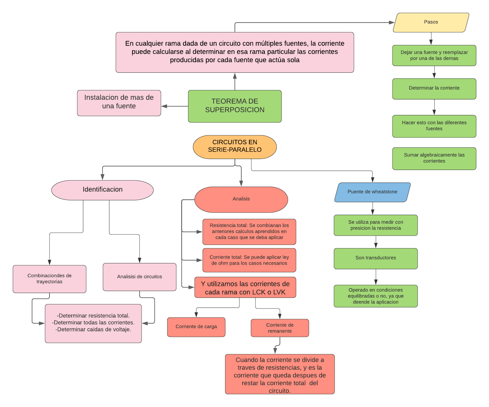
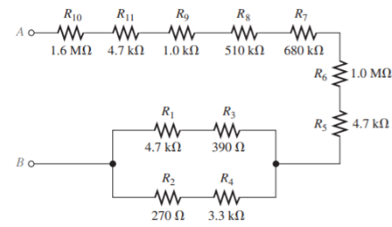
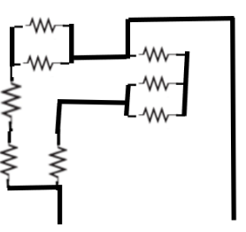
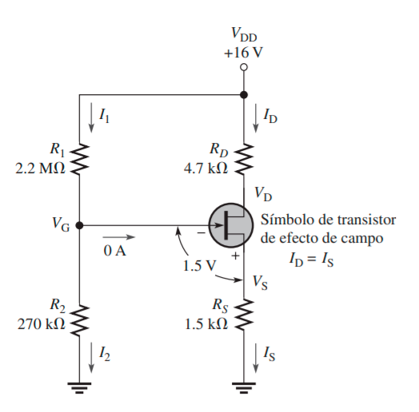
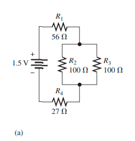
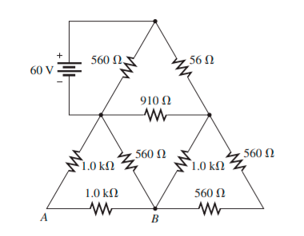
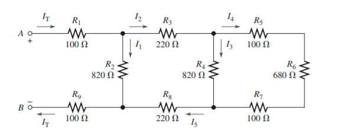
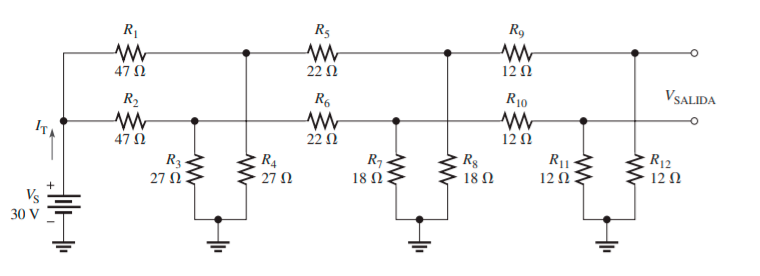
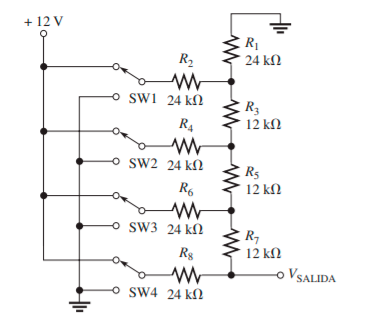

# Informe_Tarea_1_2P
# Objetivo
Objetivo General:
- Analizar los circuitos en Serie y en Paralelo, mediante el uso de diferentes leyes aplicables para los circuitos, para lograr establecer semejanzas y diferencias durante la resolución de problemas.

Objetivo Especifico:
- Analizar las fallas que se pueden presentar en los circuitos en serie y paralelo, siguiendo el algoritmo de solución correctamente.
- Determinar el efecto de carga de un voltímetro en un circuitoDeterminar el efecto de carga de un voltímetro en un circuito.
- Describir las características de una fuente de voltaje de cd,  las características de una fuente de corriente.

# Marco Teorico
Circuitos en Serie – Paralelo
1.- IDENTIFICACIÓN DE RELACIONES EN SERIE-PARALELO
Es una disposición del circuito, en donde se encuentran pequeños circuitos en serie y paralelo.
Como se ve en la imagen, la corriente total pasa por la resistencia R1, y a partir del punto B, la corriente se divide, teniendo un valor diferente en la resistencia R2 y R3, para que luego estas corrientes parciales se unan en el nodo C, y así se vuelve una corriente total.
Entonces la corriente equivalente del sistema se puede expresar como:
RT = (R3||R2 + R1) 

2.- ANÁLISIS DE CIRCUITOS RESISTIVOS EN SERIE-PARALELO
Resistencia total: Primero se debe reconocer la disposición de las resistencias y sus relaciones, para determinar que resistencias están en serie con otras, y que resistencias están en paralelo con otras.

En este Circuito, se identifica que las dos resistencias de 100 ohms están en paralelo, por lo que: 

Entonces, la Resistencia equivalente del circuito es:

Corriente total: Al determinar la resistencia equivalente del circuito, se puede calcular la corriente total:

Corrientes de rama: Mediante la utilización de los diferentes métodos de resolución de circuitos, se puede determinar la corriente en cada rama del circuito.
Por ejemplo, para determinar la corriente en R2 y r3 del circuito, se sigue los siguientes pasos:

Caídas de voltaje: Es necesario determinar el voltaje en ciertos puntos del circuito, utilizando los diferentes métodos de resolución de circuitos.

3.- DIVISORES DE VOLTAJE CON CARGAS RESISTIVAS

En la imagen se puede observar que, en el primer circuito, el divisor de voltaje se encuentra sin carga resistiva, por lo que el voltaje de 10 V se divide en un voltaje de 5 V, ya que las dos resistencias son de igual valor. En cambio, en el segundo circuito, se ha añadido una carga resistiva, por lo que la división del voltaje va a tener menor valor, y por ende, la resistencia total de todo el circuito también bajará.

Corriente de carga y corriente remanente: Las corrientes de carga son aquella que circulas por las resistencias de carga.
La corriente remanente es aquella que queda cuando se resta la corriente de carga total de la corriente toral del circuito.

Divisores de voltaje bipolar: Se refiere cuando ni la terminal positiva ni la terminal negativa de la fuente están conectadas a la Tierra Común, por lo que, con respecto a la tierra de referencia, los voltajes A y B son positivos, y los voltajes C y D son negativos.

4.- EFECTO DE CARGA DE UN VOLTÍMETRO
Un voltímetro, al tener resistencia interna, afectará de cierta forma a la medición de voltaje del circuito. La resistencia interna del voltímetro afectará al circuito, si la resistencia no es lo suficientemente grande como la resistencia total del circuito.

Considerando la medición de voltaje con el voltímetro, se ve que la resistencia interna se encuentra en paralelo con la resistencia R3, entonces la resistencia total bajará, según el valor de la resistencia interna del voltímetro.

5.- REDES EN ESCALERA
Estas redes es un caso especial de los circuitos serie-paralelo. Para analizarlas, se deben simplificar las redes desde la más lejana de la fuente de voltaje.

En este caso, primero se analizan las resistencias R4, R5 y R6, y posteriormente seguir simplificando las demás resistencias.

Para calcular la corriente total del circuito, se procede a determinar las corrientes equivalentes desde el punto más alejado de la fuente de voltaje.

Dando como resultado al siguiente circuito:

Para seguir simplificando:

Por lo que queda un circuito reducido así:

Entonces, ya es un circuito sencillo que se puede resolver con la ley de Ohm:

TEOREMAS DE CIRCUITOS Y CONVERSIONES

1.- LA FUENTE DE VOLTAJE DE CD
En el análisis de circuitos, siempre se considera que las fuentes de voltaje son ideales. Sin embargo, cada una de estas fuentes posee una resistencia interna, ya sea por sus propiedades físicas, o por sus propiedades químicas.
A pesar de esto, se puede utilizar una fuente de potencia para lograr acercarse a la fuente de voltaje ideal.
Carga de la fuente de voltaje: Al conectar una carga resistiva en un circuito, la fuente de voltaje empieza a actuar en los extremos de ella. Si la carga resistiva llega a ser de un valor pequeño, la carga de fuente de voltaje se acerca al ideal.

2.- LA FUENTE DE CORRIENTE
Una fuente de corriente ideal proporciona un valor constante de corriente a través de de una carga resistiva, sin importar cuánto sea el valor de la carga.

En la imagen se ilustra la disposición de una fuente de corriente dentro de un circuito. En este caso, la resistencia interna de la fuente de corriente está actuando en paralelo con la resistencia Rs. Si la resistencia interna llega a superar en su valor a la resistencia RL, el sistema se podría considerar ideal.

3.- CONVERSIONES DE FUENTE
Conversión de una fuente de voltaje en una fuente de corriente

Se introduce un nuevo concepto que se denomina Equivalencia terminal el cual enuncia que, con cualquier valor de una carga resistiva que se conecte a los dos tipos de fuentes, producirán un mismo valor de carga de voltaje y carga de corriente  

Conversión de una fuente de corriente en una fuente de voltaje

4.- EL TEOREMA DE SUPERPOSICIÓN
El enunciado general de este teorema es:
En cualquier rama dada de un circuito con múltiples fuentes, la corriente puede calcularse al determinar en esa rama particular las corrientes producidas por cada fuente que actúa sola, con todas las demás fuentes reemplazadas por sus resistencias internas. La corriente total en la rama es la suma algebraica de las corrientes individuales presentes
en dicha rama.

Para aplicar el teorema, se siguen los siguientes pasos:

-Dejar una fuente a la vez dentro del circuito de análisis, y reemplazar las demás fuentes con el valor de su resistencia interna.

-Determinar la corriente dentro del circuito obtenido (sólo una fuente)

-Repetir los dos pasos anteriores con las otras fuentes.

-Al acabar con todas las fuentes y sus corrientes, se debe realizar una suma algebraica de todas las corrientes parciales obtenidas. Con esto se determina el valor verdadero de la corriente.

5.- TEOREMA DE THEVENIN 

El teorema se utiliza para simplificar el circuito que se quiere analizar, a una forma más simplificada y sencilla para el análisis.

“En un circuito eléctrico, el voltaje equivalente de Thevenin (VTH) es el voltaje de circuito
abierto (sin carga) presente entre dos terminales de salida”

“La resistencia equivalente de Thevenin (RTH) es la resistencia total que aparece entre dos
terminales en un circuito dado que tiene todas las fuentes reemplazadas por sus resistencias
internas”

La equivalencia Thevenin dependiendo desde qué terminales es visto: Las equivalencias de Thevenin son diferentes, dependiendo desde que terminales se ve el circuito.

En este circuito, la equivalencia de Thevenin va a ser diferente si se ve el circuito desde las terminales A y C, que de las terminales A y B, o de las terminales B y C.

6.- TEOREMA DE NORTON

Este teorema simplifica un circuito lineal de dos terminales, en un circuito equivalente con sólo una fuente de corriente en paralelo con un resistor.

Corriente equivalente de Norton (IN): La corriente equivalente de Norton (IN) es la corriente que se encuentra en cortocircuito entre dos terminales de salida de un circuito.

Resistencia equivalente de Norton (RN): La resistencia equivalente de Norton, RN, es la resistencia total que aparece entre dos terminales de salida en un circuito dado que tiene todas las fuentes reemplazadas por sus resistencias internas.

7.- TEOREMA DE TRANSFERENCIA DE POTENCIA MÁXIMA

“Para una fuente de voltaje dada, la potencia máxima se transfiere desde una fuente hasta una carga cuando la resistencia de la carga es igual a la resistencia interna de la fuente.”

CONVERSIONES DELTA A Y, Y Y A DELTA.

Conversión Delta a Y: Cada resistor localizado en la Y es igual al producto de los resistores incluidos en dos ramas delta adyacentes, dividido entre la suma de los tres resistores en delta.

Conversión Y a Delta: Cada resistor incluido en la delta es igual a la suma de todos los posibles productos de resistores. Y tomados dos a la vez, y divididos entre el resistor Y opuesto. 

**MAPA CONCEPTUAL**

# Resolucion de ejercicios.
1. Visualice y trace las siguientes combinaciones en serie-paralelo:
(a) R1 en serie con la combinación en paralelo de R2 y R3

(b)R1 en paralelo con la combinación en serie de R2 y R3

(c) R1 en paralelo con una rama que contiene R2 en serie con una combinación en paralelo de otros cuatro resistores

3. En cada circuito de la figura 7-62, identifique las relaciones en serie-paralelo de los resistores vistas desde la fuente.
Primer circuito:  R1 y R4 están en serie con la combinación en paralelo de R2 y R3.
Segundo Circuito: R1 está en serie con la combinación en paralelo de R2, R3 y R4.
Tercer circuito: La combinación en paralelo de R2 y R3 está en serie con la combinación en paralelo de R4 y R5. Todo esto está en paralelo con R1.
5. Trace el diagrama esquemático de la configuración de la tarjeta de circuito impreso mostrada en la figura 7-64 indicando valores de resistor, e identifique las relaciones en serie-paralelo

7. Configure una tarjeta de circuito impreso para el circuito de la figura 7-63(c). La batería tiene que conectarse externa a la tarjeta.

9. Para cada uno de los circuitos mostrados en la figura 7-62, determine la resistencia total presentada a la fuente.

Figura 1
Rt= 56+(1/(1/100+1/100))+27=83+50
a) 113 Ω
Figura 2
Rt= 680 +(1/(1/680+1/330+1/180))=680+99
b) 779 Ω
Figura 3
Rt= 1k Ω+(1/(1/6.2k Ω+1/3.3k Ω))+(1/(1/10k Ω+1/5.6k Ω))
c) 852 Ω

11. Determine la corriente a través de cada resistor del circuito de la figura 7-62; calcule en seguida cada caída de voltaje.

Figura a.
Re= 1/(1/100+1/100)=50Ω
Rt=56 Ω+50 Ω+27 Ω=133 Ω

I1=I4=v/r=1.5v/133 Ω=0.011278mA=11.3mA
I2=I3= (50/100) *11.3mA= 564mA

V1= 633mV
V2=V3=564mV
V4=305mV

Figura b.
Re=99 Ω

I1=3.85mA
I2=563µA
I3=1.16mA 
I4=2.13mA

V1=2.62V
V2=V3=V4=383mV

Figura c.
Re1= 2153.68 Ω
Re2=3589.74 Ω
Re1y2=Re3=5643.42 Ω
Re3R1= 849.47 Ω

I=5V/ 849.47 Ω=5.886mA
I1=5mA
I2=303µA
I3=568µA
I4=313µA
I5=558µA

V1=5V
V2=V3=1.88V
V4=V5=3.13V

13. Encuentre RT para todas las combinaciones de los interruptores de la figura 7-66.

SW1 cerrado, SW2 abierto: 220 Ω, SW1 cerrado, SW2 cerrado: 200 Ω, SW1 abierto, SW2 abierto: 320 Ω, SW1 abierto, SW2 cerrado: 300 Ω

15. Determine el voltaje en cada nodo con respecto a tierra en la figura 7-67.
RE1=4.7K Ω+5.6K Ω=10.3K Ω
REM1=1/(1/10K Ω+1/10.3K Ω)=5073.89Ω
REM2=1/(1/1.8K Ω+1/2K Ω)=947.36Ω

VA=100V

Aplicando divisor de voltaje.
VB=61.5V
VC=15.7V
VD=7.87V

17. En la figura 7-68, ¿cómo determinaría el voltaje entre los extremos de R2 por medición sin conectar directamente un medidor entre los extremos del resistor?

Medir el voltaje en A con respecto a tierra 

El voltaje en B con respecto a tierra.

La diferencia es VR2.

19. Determine la resistencia del circuito mostrado en la figura 7-68 como se ve desde la fuente de voltaje.

RP1=R3yR4=1030Ω
R5yR6=RE56=1/(1/1kΩ+1/1.5k Ω)=600Ω
RP2=R2+ RE56+R7+R8= 1680 Ω
RP1||RP2=1/(1/1680 Ω+1/1030 Ω)=638.52 Ω
RT=303K Ω

21. (a) Determine el valor de R2 en la figura 7-70. (b) Encuentre la potencia en R2.

(a) ley de Wheatstone = 110 kΩ
(b)P=V*I=110 mW

23. Encuentre la resistencia entre cada uno de los siguientes juegos de nodos mostrados en la figura 7-72: AB, BC y CD.

AB=1650Ω
BC=3.3 kΩ
CD=0

25. Un divisor de voltaje está compuesto por dos resistores de 56 kΩ y una fuente de 15 V. Calcule el voltaje de salida sin carga. ¿Cuál será el voltaje de salida si se conecta un resistor con carga de 1 MΩ a la salida?

Vx=(Vs/Rt)*Rx
7.5 V sin carga, 7.29 V con carga

27. ¿Cuál de dos cargas, una de 10 kΩ y otra de 47 kΩ, provocará una disminución más pequeña en el voltaje de salida de un divisor de voltaje dado?

A mayor resistencia menor intensidad
El que provoca una disminución de voltaje es la de 47KΩ

29. En la figura 7-74, determine el voltaje de salida con una carga de 33 kΩ conectada entre A y B

Vx=(Vs/Rt)*Rx
Re=1/(1/8.3kΩ+1/33kΩ)
Re=6631.96Ω
Vx=(22/18.3kΩ) * 6631.96Ω
Vx=8.77 V

31.- Determine los valores de resistencia para un divisor de voltaje que debe satisfacer las siguientes especificaciones: la corriente extraída de la fuente sin carga no debe exceder de 5 mA; el voltaje de fuente tiene que ser de 10 V, y las salidas requeridas deben ser de 5 y 2.5 V. Trace el circuito. Determine el efecto en los voltajes de salida si se conecta una carga de 1.0 kΩ a cada toma, una a la vez.

33.- La figura 7-76 muestra un circuito polarizador de cd para un amplificador de transistor de efecto de campo. La polarización es un método común empleado para establecer ciertos niveles de voltaje de cd para la operación apropiada de un amplificador. Aunque no se espera que usted conozca los amplificadores con transistores en este momento, los voltajes y las corrientes de cd presentes en el circuito pueden ser determinados con métodos ya conocidos.

(a) Encuentre VG y VS 
Req1=1/(1/2200k + 1/4,7k)= 4,689 kΩ

Req2=1/(1/270k + 1/1,5k)=1,4917kΩ 
(16-VG)/4,689k = VG/1,4917k

VG=4,07962 V
VS=4,07962 V

(b) Determine I1, I2, ID, e IS 

I1=16/2200=7,2 x10^-3 mA
I2=4,079/270k= 0,015mA
ID=16/4,7=3,40mA
IS=3,40mA

(c) Encuentre VDS y VDG

(16-VDS)/4,7k +(16-VDS)/2200k =VDS/1.5k
3,411k= VDS/4,7k +VDS/2200k + VDS/1.5k
VDS=3,411/0.8798=3,87V
 (16-VGD)/4,689k+ (16-VGD)/4,689  = VGD/1,4917k
6,8244= VGD/1,4917 + VGD/4,689 + VGD/4,689
VGD= 6,22 V

35.- ¿En cuál de los siguientes intervalos de voltaje presentará un voltímetro la mínima carga que haya en un circuito? 
Un voltímetro aplica carga a un circuito porque la resistencia interna del medidor aparece en paralelo con la resistencia del circuito entre el cual está conectado, por lo que la resistencia entre esos dos puntos del circuito disminuye y se extrae corriente del circuito

(a) 1 V (b) 10 V (c) 100 V (d) 1000 V

37.-  El voltímetro descrito en el problema 36 se utiliza para medir voltaje entre los extremos de R4 en la figura 7-62(a).

(a) ¿Qué intervalo se deberá utilizar?
De 5V

(b) ¿En cuánto se reduce el voltaje medido por el medidor con respecto al voltaje real?
5v-1.5v=3.5V

39.- Para el circuito mostrado en la figura 7-77, calcule: 

(a) La resistencia total entre las terminales de la fuente

Req1=560+560=1120Ω

Req2=1k+1k=2k Ω

Req3=560+2k=2,56k Ω

Req4=1k+1120=2120 Ω

R1estrella=(560*56)/(560+56+910)=20,50 Ω
R2estrella=(560*910)/(560+56+910)=333,94 Ω
R3estrella=(56*910)/(560+56+910)=33,39 Ω

Req5=333,94+2,56k=2893,94 Ω
Req6=33,39+2120=2153,39
Req7=1234,66 Ω

RT=1234,66+20,50=1255,1689 Ω

(b) La corriente total suministrada por la fuente 
IT=60/1255,1689=0,04780 A

(c) La corriente a través del resistor de 910 Ω 
Ix=60/(560+910)=0,0408

(d) El voltaje desde el punto A hasta el punto B
VR1=60/20,50=2,92v

Ieq7=2,92/1234,66=2,365*10^-3

Veq5=2893,94 * 2,365*10^-3=6,84v

V1k=6,84v

41.- Determine la resistencia total entre las terminales A y B de la red en escalera de la figura 7-79. Asimismo, calcule la corriente en cada rama con 10 V entre A y B.

Req1=R5+R6+R7=100+680+100=880Ω
Req2=1/(1/880 + 1/820)=424,47 Ω
Req3=R3+R8+Req2=220+424,47+220=864,47 Ω
Req4=1/(1/820+1/864,47)=420,8239

RT=R1+R9+Req4=100+100+420,8239=620,82 Ω

N1:
I1=10/420,8239=0,023 A
N2:
I2=10/424,47= 0,02355 A

43.- Determine IT y VSALIDA en la figura 7-80.

Vsalida=15V

Req1=1/(1/R11+1/R12)=1/(1/12+1/12)=6 Ω
Req2=1/(1/R7+1/R8)=1/(1/18+1/18)=9Ω
Req3=1/(1/R3+1/R4)=1/(1/27+1/27)=13,5Ω
Req4=1/(1/12+1/12)=6 Ω
Req5=1/(1/22+1/22)=11 Ω
Req6=1/(1/47+1/47)=23,5 Ω
Req7=6+6=12 Ω
Req8=1/(1/9+1/12)=5,14 Ω
Req9=11+5,14=16,142 Ω
Req10=1/(1/13,5+1/16,142)=7,35 Ω

RT=23,5+7,35=30,85 Ω
IT=30/30,85=0,9724 A

45.- Repita el problema 44 para las siguientes condiciones 

(a) SW3 y SW4 conectados a +12 V, SW1 y SW2 a tierra 
Req1=1/(1/24k+1/24)=12k
Req2=12k+12k= 24k
Req3=1/(1/24+1/24)=12k
Req4=12k+12k=24k
R1estrella=(24*24)/(24+24+12)=9,6
R2estrella=(24*12)/(24+24+12)=4,8
R3estrella=(12*24)/(24+24+12)=4,8

Req5=24k+4,8k=28,8k

Req6=1/(1/9,6k+1/4,8k)=3,8k

RT=32,6k

IT=12/32,6=0,3680 mA

Vsalida=0,3680*28,8K=10,6012V

(b) SW3 y SW1 conectados a +12 V, SW2 y SW4 a tierra 
Req1=1/(1/24k+1/24)=12k
Req2=12k+12k= 24k
Req3=1/(1/24+1/24)=12k
Req4=12k+12k=24k

R1estrella=(24*24)/(24+24+12)=9,6

R2estrella=(24*12)/(24+24+12)=4,8
R3estrella=(12*24)/(24+24+12)=4,8

Req5=24k+4,8k=28,8k
Req6=1/(1/9,6k+1/4,8k)=3,8k

RT=32,6k

IT=12/32,6=0,3680 mA

Vsalida=0,3680*28,8K=10,6012V

(c) Todos los interruptores conectados a +12 V

Req1=24+12=36k
Req2=1/(1/24+1/36)=14,4k
Req3=14,4+12=26,4k
Req4=1/(1/26,4+1/24)=12,57k
Req5=12,57+12=24,57k
Req6=1/(1/24,57+1/24)=12,14k

RT=32,14k

Vsalida=12V

47.- Una celda de carga tiene cuatro medidores de deformación idénticos con una resistencia ilimitada de 120,000 Æ para cada medidor (un valor estándar). Cuando se agrega una carga, los medidores a tensión incrementan su resistencia en 60 mÆ, a 120,060 Æ, y los medidores a compresión disminuyen su resistencia en 60 mÆ, a 119.940 Æ, como se muestra en la figura 7-82. ¿Cuál es el voltaje de salida con carga?

El puente alcanza el estado de equilibrio cuando VA = VB; es decir, cuando VSALIDA = 0

49. ¿Es correcta la lectura del voltímetro de la figura 7-84?

El calculo seria obtener la corriente total y sacar el voltaje del nodo que une a las dos resistencias por lo tanto nos daría un total de 4,38 por lo que la lectura esta mal en este caso.

51. En la figura 7-86 hay una falla. Con base en las indicaciones del medidor, determine cuál es la falla.

El voltímetro que muestra la cantidad de cero porque, este debería estar dando el valor del voltaje conectado del nodo que une las resistencias R4 y R5.

53. Revise las lecturas de los medidores de la figura 7-88 y localice cualquier falla que pudiera existir.
Req1=1+2,2=3,2k
Req2=1/(1/3,2k+1/3,3)=1,6246k

RT=1+1,6246=2,6246k

IT=10/2,62=3,81mA

V1=3,81*2,6246=9,976v
Por lo que el voltimetro numero dos esta mostrando el valor mal.

7. Con el método de superposición, encuentre la corriente a través de R5 en la figura 8-69.

Primero, reemplazamos La fuente de voltaje de 2V por su resistencia equivalente, en este caso es de 0. Y procedemos a realizar un análisis de mallas en el nuevo circuito.

9. Con el teorema de superposición, determine la corriente a través de R3 en la figura 8-70.

11. En la figura 8-72 se muestra un circuito comparador. El voltaje de entrada, VENTRADA, se compara con el voltaje de referencia, VREFERENCIA, y se genera una salida negativa si VREFERENCIA > VENTRADA; de lo contrario es positiva. El comparador no carga a una u otra entrada. Si R2 es de 1.0 kohm, ¿cuál es el intervalo
del voltaje de referencia?

13. Determine el voltaje del punto A al punto B en la figura 8-73.

15. La figura 8-75 muestra dos redes en escalera. Determine la corriente producida por cada una de las baterías cuando se conectan las terminales A (A a A) y las terminales B (B a B).

17. Con el teorema de Thevenin, determine la corriente a través de la carga RL en la figura 8-77.

19. Determine el equivalente de Thevenin para el circuito externo al amplificador de la figura 8-79.

*21. Determine la corriente a través del resistor de carga en el circuito puente de la figura 8-81.

“FIGURA 23 Y 24”

23. Para cada uno de los circuitos mostrados en la figura 8-76, determine el equivalente Norton visto por RL.

“FIGURA 25, 26, 27, 28 Y 29”

25. Con el teorema de Norton, determine el voltaje entre los extremos de R5 en la figura 8-78.

27. Determine el circuito equivalente Norton para el puente que aparece en la figura 8-81 sin RL.

29. Aplique el teorema de Norton al circuito de la figura 8-84.

31. En el circuito de la figura 8-86, determine el valor de RL para transferencia de potencia máxima.

33. ¿Cuáles son los valores de R4 y RTH cuando la potencia máxima se transfiere de la fuente thevenizada
a la red en configuración de escalera de la figura 8-87?

35. En la figura 8-89, convierta cada red Y en una red delta.

# Video

https://youtu.be/Zxqx_UqszYg

# Conclusiones
- Logramos comprender las características de una fuente de voltaje de cd y  las características de una fuente de corriente.
- En el análisis de circuitos, en ocasiones es útil convertir una fuente de voltaje en una
fuente de corriente equivalente, o viceversa. 
- Algunos circuitos requieren la instalación de más de una fuente de voltaje o de corriente. Por ejemplo, la mayoría de los amplificadores operan con dos fuentes de voltaje: una fuente de cd y una de ca

# Bibliografia
Floyd, T. (2007). Voltaje, corriente y resistencia. En L. M. Cruz Castillo (Ed.), Principios de Circuitos Eléctricos (VIII ed., pp. 16-71). Pearson Educación. Floyd, T. (2007). Cantidades y unidades. En L. M. Cruz Castillo (Ed.), Principios de Circuitos Eléctricos (VIII ed., pp. 1-15). Pearson Educación Abreu, R. (2005). Fuentes de alimentación conmutadas. El1313-Electrónica III 2005, 4,5. http://www.el.bqto.unexpo.edu.ve/rabreu/Electronica3/Clase9.pdf
