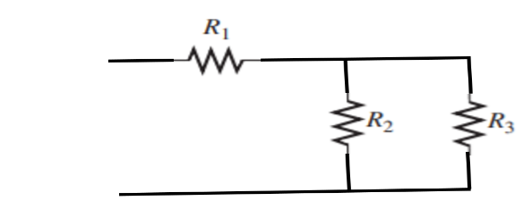
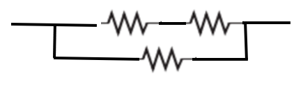
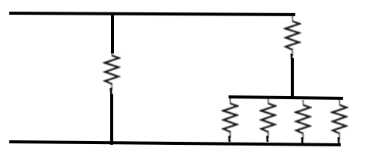

# Informe_Tarea_1_2P
# Objetivo
Objetivo General:
Objetivo Especifico:
# Marco Teorico
# Resolucion de ejercicios.
1. Visualice y trace las siguientes combinaciones en serie-paralelo:
(a) R1 en serie con la combinación en paralelo de R2 y R3

(b)R1 en paralelo con la combinación en serie de R2 y R3

(c) R1 en paralelo con una rama que contiene R2 en serie con una combinación en paralelo de otros cuatro resistores

3. En cada circuito de la figura 7-62, identifique las relaciones en serie-paralelo de los resistores vistas desde la fuente.
Primer circuito:  R1 y R4 están en serie con la combinación en paralelo de R2 y R3.
Segundo Circuito: R1 está en serie con la combinación en paralelo de R2, R3 y R4.
Tercer circuito: La combinación en paralelo de R2 y R3 está en serie con la combinación en paralelo de R4 y R5. Todo esto está en paralelo con R1.
5. Trace el diagrama esquemático de la configuración de la tarjeta de circuito impreso mostrada en la figura 7-64 indicando valores de resistor, e identifique las relaciones en serie-paralelo

7. Configure una tarjeta de circuito impreso para el circuito de la figura 7-63(c). La batería tiene que conectarse externa a la tarjeta.
8. 
9. 9. Para cada uno de los circuitos mostrados en la figura 7-62, determine la resistencia total presentada a la fuente.
Figura 1
Rt= 56+(1/(1/100+1/100))+27=83+50
a) 113 Ω
Figura 2
Rt= 680 +(1/(1/680+1/330+1/180))=680+99
b) 779 Ω
Figura 3
Rt= 1k Ω+(1/(1/6.2k Ω+1/3.3k Ω))+(1/(1/10k Ω+1/5.6k Ω))
c) 852 Ω
11. Determine la corriente a través de cada resistor del circuito de la figura 7-62; calcule en seguida cada caída de voltaje.
Figura a.
Re= 1/(1/100+1/100)=50Ω
Rt=56 Ω+50 Ω+27 Ω=133 Ω
I1=I4=v/r=1.5v/133 Ω=0.011278mA=11.3mA
I2=I3= (50/100) *11.3mA= 564mA
V1= 633mV
V2=V3=564mV
V4=305mV
Figura b.
Re=99 Ω
I1=3.85mA
I2=563µA
I3=1.16mA 
I4=2.13mA
V1=2.62V
V2=V3=V4=383mV
Figura c.
Re1= 2153.68 Ω
Re2=3589.74 Ω
Re1y2=Re3=5643.42 Ω
Re3R1= 849.47 Ω
I=5V/ 849.47 Ω=5.886mA
I1=5mA
I2=303µA
I3=568µA
I4=313µA
I5=558µA
V1=5V
V2=V3=1.88V
V4=V5=3.13V
13. Encuentre RT para todas las combinaciones de los interruptores de la figura 7-66.
SW1 cerrado, SW2 abierto: 220 Ω, SW1 cerrado, SW2 cerrado: 200 Ω, SW1 abierto, SW2 abierto: 320 Ω, SW1 abierto, SW2 cerrado: 300 Ω
15. Determine el voltaje en cada nodo con respecto a tierra en la figura 7-67.
RE1=4.7K Ω+5.6K Ω=10.3K Ω
REM1=1/(1/10K Ω+1/10.3K Ω)=5073.89Ω
REM2=1/(1/1.8K Ω+1/2K Ω)=947.36Ω
VA=100V
Aplicando divisor de voltaje.
VB=61.5V
VC=15.7V
VD=7.87V
17. En la figura 7-68, ¿cómo determinaría el voltaje entre los extremos de R2 por medición sin conectar directamente un medidor entre los extremos del resistor?
Medir el voltaje en A con respecto a tierra 
El voltaje en B con respecto a tierra.
La diferencia es VR2.
19. Determine la resistencia del circuito mostrado en la figura 7-68 como se ve desde la fuente de voltaje.
RP1=R3yR4=1030Ω
R5yR6=RE56=1/(1/1kΩ+1/1.5k Ω)=600Ω
RP2=R2+ RE56+R7+R8= 1680 Ω
RP1||RP2=1/(1/1680 Ω+1/1030 Ω)=638.52 Ω
RT=303K Ω
21. (a) Determine el valor de R2 en la figura 7-70. (b) Encuentre la potencia en R2.
(a) ley de Wheatstone = 110 kΩ
(b)P=V*I=110 mW

23. Encuentre la resistencia entre cada uno de los siguientes juegos de nodos mostrados en la figura 7-72: AB, BC y CD.
AB=1650Ω
BC=3.3 kΩ
CD=0
25. Un divisor de voltaje está compuesto por dos resistores de 56 kΩ y una fuente de 15 V. Calcule el voltaje de salida sin carga. ¿Cuál será el voltaje de salida si se conecta un resistor con carga de 1 MΩ a la salida?
Vx=(Vs/Rt)*Rx
7.5 V sin carga, 7.29 V con carga
27. ¿Cuál de dos cargas, una de 10 kΩ y otra de 47 kΩ, provocará una disminución más pequeña en el voltaje de salida de un divisor de voltaje dado?
A mayor resistencia menor intensidad
El que provoca una disminución de voltaje es la de 47KΩ
29. En la figura 7-74, determine el voltaje de salida con una carga de 33 kΩ conectada entre A y B
Vx=(Vs/Rt)*Rx
Re=1/(1/8.3kΩ+1/33kΩ)
Re=6631.96Ω
Vx=(22/18.3kΩ) * 6631.96Ω
Vx=8.77 V

# Video

# Conclusiones

# Recomendaciones

# Biblioografia

